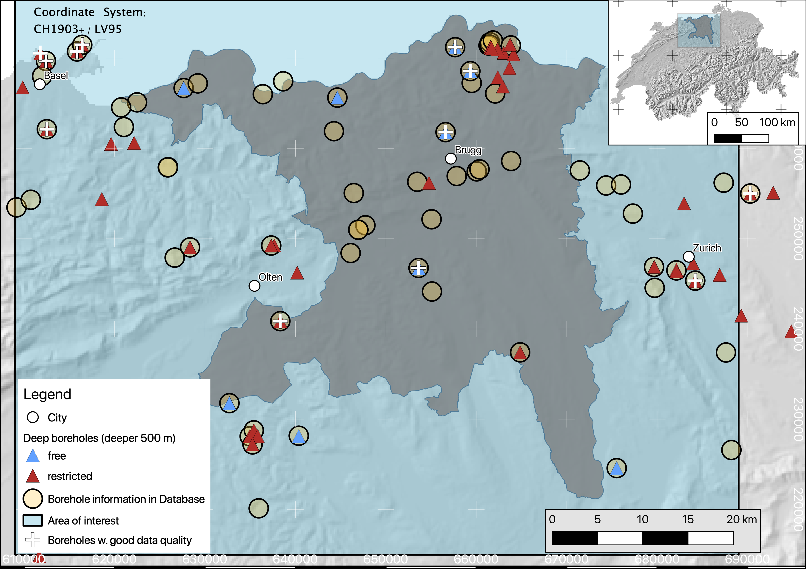

.. DO NOT EDIT.
.. THIS FILE WAS AUTOMATICALLY GENERATED BY SPHINX-GALLERY.
.. TO MAKE CHANGES, EDIT THE SOURCE PYTHON FILE:
.. "WP1-data_analysis\WP01_borehole_database.py"
.. LINE NUMBERS ARE GIVEN BELOW.

.. only:: html

    .. note::
        :class: sphx-glr-download-link-note

        Click :ref:`here <sphx_glr_download_WP1-data_analysis_WP01_borehole_database.py>`
        to download the full example code

.. rst-class:: sphx-glr-example-title

.. _sphx_glr_WP1-data_analysis_WP01_borehole_database.py:

Temperature database usage
==========================

In the following, I present ways to interact with a database of borehole temperatures in the study area, using the module `db_access`.
These temperature data are used in other workpackages, e.g. for model calibration or MC-rejection.

.. GENERATED FROM PYTHON SOURCE LINES 12-64

Borehole Database
=================

It is no surprise that the core of a data-driven project is data. Data which is organized in a specific manner, so that users can easily access,
analyse, and manipulate data. Many different schemes exist, in which data can be organized, with a most common one being spreadsheet-like tables.
Thus, spreadsheet software like Microsoft Excel or Libre-Office Calc are among popular solutions, when it comes to working with data.

With growing amount of data, however, these software solutions may soon meet their limits, as they can get overly complicated. One example would be many :code:`.xls` files,
which are connected among each other using hyperlinks. This is obviously an error-prone solution, not really practical. Thus, greater amounts of data with a more complex structure,
are usually maintained in a `database <https://en.wikipedia.org/wiki/Database>`_, following a certain `data model <https://en.wikipedia.org/wiki/Data_model>`_.
Here, we use `SQLITE <https://www.sqlite.org/index.html>`_ [1] as underlying database solution, a SQL database engine.

In the following, we will briefly describe the database structure, its content and provide some short examples how to access the database and work with the stored data.

Data model
----------

Within the database, we follow, as we use SQL, a `relational model <https://en.wikipedia.org/wiki/Relational_model>`_ to organize stored data.
This data comprises mainly borehole temperature measurements in the study area. The data was originally compiled by Schärli and Kohl [2] in a set of excel tables. 
This *original* data, i.e. in its excel form, is available as supplementary material to the NAGRA Working report
`NAB 12-61 <https://www.nagra.ch/de/cat/publikationen/arbeitsberichte-nabs/nabs-2012/downloadcenter.htm>`_. 
This report comprises temperature measurements for boreholes all over Switzerland. Additionally, a stratigraphical description is available for some boreholes. 

Many of the temperature data from these deep boreholes is compiled in Schärli and Kohl [2], in addition to temperature data from *shallow* boreholes, i.e. shallower than 500 m.
In this work, we use a subset of this data which is (**a**) inside our area of interest, and (**b**) publicly available data. 
For instance, the map further down shows a subset of deep boreholes (triangles) in the study area, colored by the data restriction. 
While blue represents open data, boreholes colored in red contain confidential data. Within the database, this information is stored, so confidential data can easily be erased from the database, 
in case it is made public.

Currently, the database contains three related tables:
* general borehole information (coordinates, name, original source, ...)  
* temperature depth information for all boreholes  
* available petrophysical information  

Not much petrophysical data is available from the boreholes. Temperature depth information, however, comprises more than 39000 data points. 
In the following, we present methods and procedures to access these data and work with it from within this notebook. For this, we use a mixture of SQL queries and methods of the data analysis library 
`pandas <https://pandas.pydata.org/>`_. 

Acessing data and visualizing
-----------------------------
Querying a database is maybe the most often performed task, when it comes to databases. When you type something in a seach bar, for example, you query a database for the words you are looking for. 
The same, though in a more rudimentary form, can be done with the compiled "borehole temperature" database. 

The following code cells in this notebook show how:
- to connect to the database  
- introduces a very small library :code:`db_access`
- get information about available tables in the database
- formulate queries to get desired data, e.g. temperature depth pairs for a specific borehole
- store query results in a pandas dataframe and visualize them  

.. GENERATED FROM PYTHON SOURCE LINES 64-77

.. code-block:: default

    import sys
    import platform
    sys.path.append('../..')
    import OpenWF.db_access as db_access

    import pandas as pd
    import numpy as np
    import matplotlib.pyplot as plt
    from matplotlib.cm import get_cmap
    from scipy.stats import gaussian_kde
    from sklearn.linear_model import LinearRegression

.. GENERATED FROM PYTHON SOURCE LINES 78-79

relative path to the .db file, which is the actual database

.. GENERATED FROM PYTHON SOURCE LINES 79-86

.. code-block:: default

    os_name = platform.system()
    if os_name=='Linux':
        db_path = '../../../../ETHeatflow/dbase_model_btemps.db'
    elif os_name=='Windows':
        db_path = '../../../../db_borehole_temps/dbase_model_btemps.db'

.. GENERATED FROM PYTHON SOURCE LINES 87-88

connect to the database and get information about stored tables with the ``connect`` routine

.. GENERATED FROM PYTHON SOURCE LINES 88-91

.. code-block:: default

    conn, c = db_access.connect(db_path)

.. GENERATED FROM PYTHON SOURCE LINES 92-95

At this point, we successfully connected to the database. One next step would be to see, what different tables are stored in the database. :code:`db_access` provides you with methods to do so. 
Of course, one can directly use an SQL query to do so. For user convenience, such queries are wrapped in some python methods of :code:`db_access`. 
For instance, let's check the names of tables in the database:

.. GENERATED FROM PYTHON SOURCE LINES 95-101

.. code-block:: default

    c.execute("SELECT name FROM sqlite_master WHERE type='table';")
    print(c.fetchall())

    db_access.get_tables(c)

.. rst-class:: sphx-glr-script-out

 Out:

 .. code-block:: none

    [('sample_information_petrophysics',), ('borehole_information_temperatures',), ('temperature_data_empty_depthasl',), ('temperature_data_bak',), ('temperature_data',)]

    [('sample_information_petrophysics',), ('borehole_information_temperatures',), ('temperature_data_empty_depthasl',), ('temperature_data_bak',), ('temperature_data',)]

.. GENERATED FROM PYTHON SOURCE LINES 102-110

Essentially, these two commands do the same thing. In the :code:`db_access` method, the :code:`c.execute` and :code:`c.fetchall` commands are bundled in one method, :code:`.get_tables()`. 
The result are the three tables:  
- borehole_information_temperatures  
- temperature_data (with one backup table, marked with extension \_bak)  
- sample_information_petrophysics  

In its current state, `db_access` comprises very basic query methods. More specific data-queries still need to be done via the `c.execute` and `c.fetchall` chain which is extremely versatile.  
For instance, consider out of the over 30000 data entries, we want to get all temperature measurements for Borehole Nr. 111. 

.. GENERATED FROM PYTHON SOURCE LINES 110-114

.. code-block:: default

    c.execute("SELECT * FROM {tn} WHERE {idf}=111;".format(tn='temperature_data', idf='Nr'))
    print(c.fetchall())

.. rst-class:: sphx-glr-script-out

 Out:

 .. code-block:: none

    [(8.74, 2.12, 111, 1, '1988', 'BHT', 5026, 273.88), (31.05, 597.52, 111, 1, '1988', 'BHT', 5027, -321.52), (56.13, 1180.85, 111, 1, '1988', 'BHT', 5028, -904.8499999999999), (71.59, 1533.38, 111, 1, '1988', 'BHT', 5029, -1257.38)]

.. GENERATED FROM PYTHON SOURCE LINES 115-116

To get the name of this borehole, we can relate to the table *borehole_information_temperatures* and query the name for the borehole with Nr. 111 in the exact same way:

.. GENERATED FROM PYTHON SOURCE LINES 116-121

.. code-block:: default

    c.execute("SELECT {param} FROM {tn} WHERE {idf}=111;".format(param='Namenach',
                                                                 tn='borehole_information_temperatures', idf='Nr'))
    print(c.fetchall())

.. rst-class:: sphx-glr-script-out

 Out:

 .. code-block:: none

    [('Riehen-1',)]

.. GENERATED FROM PYTHON SOURCE LINES 122-130

.. code-block:: default

    # To know which columns are available to choose from as `{param}` in the `execute` command, we can either list names fetched by an `execute` command:

    nam = c.execute("select * from borehole_information_temperatures")
    names = list(map(lambda x: x[0], nam.description))
    print(names)

.. rst-class:: sphx-glr-script-out

 Out:

 .. code-block:: none

    ['NagraID', 'NagraBohr', 'Nr', 'Namenach', 'Land', 'X', 'Y', 'Z', 'H', 'Messart', 'Bereichob', 'Bereichun', '#', 'Qualitaet', 'Jahr', 'Geo', 'Zweck', 'Original-', 'Bemerkungen', 'Confidential', 'Notiz', 'ID']

.. GENERATED FROM PYTHON SOURCE LINES 131-132

... or use a `db_access` method which returns this list of table headers:

.. GENERATED FROM PYTHON SOURCE LINES 132-137

.. code-block:: default

    db_access.get_columns(c,table='borehole_information_temperatures')

.. rst-class:: sphx-glr-script-out

 Out:

 .. code-block:: none

    ['NagraID', 'NagraBohr', 'Nr', 'Namenach', 'Land', 'X', 'Y', 'Z', 'H', 'Messart', 'Bereichob', 'Bereichun', '#', 'Qualitaet', 'Jahr', 'Geo', 'Zweck', 'Original-', 'Bemerkungen', 'Confidential', 'Notiz', 'ID']

.. GENERATED FROM PYTHON SOURCE LINES 138-143

Now back to the query above, where we asked the database to provide all data for borehole *Riehen-1*, i.e. borehole Nr. 111. The query returns a list of table rows fitting the query command. 
While usable, it is difficult to read, at least for humans. This is, where pandas comes into play. As an extensive data analysis library, `pandas <https://pandas.pydata.org/>`_ provides a lot of tools 
to deal with a database and present them in `dataframes <https://pandas.pydata.org/pandas-docs/stable/reference/api/pandas.DataFrame.html>`_, which can be displayed in a way more organized way. 
Below, we submit a query for the temperature data for borehole Nr. 111 and display it.
query database for Borehole Nr. 111 and store it in the dataframe df.

.. GENERATED FROM PYTHON SOURCE LINES 143-147

.. code-block:: default

    df = pd.read_sql_query("select * from temperature_data where Nr = 111;", conn)
    df.head()

.. raw:: html

    

    

    
    <table border="1" class="dataframe">
      <thead>
        <tr style="text-align: right;">
          <th></th>
          <th>Temperature</th>
          <th>Depth</th>
          <th>Nr</th>
          <th>Run</th>
          <th>Datum</th>
          <th>Method</th>
          <th>Measurement_ID</th>
          <th>Depth_asl</th>
        </tr>
      </thead>
      <tbody>
        <tr>
          <th>0</th>
          <td>8.74</td>
          <td>2.12</td>
          <td>111</td>
          <td>1</td>
          <td>1988</td>
          <td>BHT</td>
          <td>5026</td>
          <td>273.88</td>
        </tr>
        <tr>
          <th>1</th>
          <td>31.05</td>
          <td>597.52</td>
          <td>111</td>
          <td>1</td>
          <td>1988</td>
          <td>BHT</td>
          <td>5027</td>
          <td>-321.52</td>
        </tr>
        <tr>
          <th>2</th>
          <td>56.13</td>
          <td>1180.85</td>
          <td>111</td>
          <td>1</td>
          <td>1988</td>
          <td>BHT</td>
          <td>5028</td>
          <td>-904.85</td>
        </tr>
        <tr>
          <th>3</th>
          <td>71.59</td>
          <td>1533.38</td>
          <td>111</td>
          <td>1</td>
          <td>1988</td>
          <td>BHT</td>
          <td>5029</td>
          <td>-1257.38</td>
        </tr>
      </tbody>
    </table>
    

    

     
     

.. GENERATED FROM PYTHON SOURCE LINES 148-150

Next to readability, another advantage of querying via pandas, and storing the result in a dataframe, is visualization. Pandas features some plotting functions, which can quickly plot parameters in a 
dataframe. For example, let's plot `Depth` versus `Temperature`:

.. GENERATED FROM PYTHON SOURCE LINES 150-161

.. code-block:: default

    df.plot.scatter(x='Temperature', y='Depth_asl', s=50)
    plt.show()

    # alternative syntax in classical matplotlib
    fig, ax = plt.subplots()
    ax.scatter(df['Temperature'], -df['Depth'], s=50)
    ax.set_ylabel('Depth [m]')
    ax.set_xlabel('Temperature [°C]')
    plt.show()

.. rst-class:: sphx-glr-horizontal

    *

      .. image-sg:: /WP1-data_analysis/images/sphx_glr_WP01_borehole_database_001.png
         :alt: WP01 borehole database
         :srcset: /WP1-data_analysis/images/sphx_glr_WP01_borehole_database_001.png
         :class: sphx-glr-multi-img

    *

      .. image-sg:: /WP1-data_analysis/images/sphx_glr_WP01_borehole_database_002.png
         :alt: WP01 borehole database
         :srcset: /WP1-data_analysis/images/sphx_glr_WP01_borehole_database_002.png
         :class: sphx-glr-multi-img

.. GENERATED FROM PYTHON SOURCE LINES 162-174

Colleagues at `Georesources Switzerland Group <https://georessourcen.ethz.ch/en/#georesources-switzerland>`_ evaluated temperature data from deep boreholes following certain criteria. 
According to their analysis, a subset of the deep boreholes contain enough data for a reliable heat-flow estimation. Boreholes passing this quality assessment are marked with white **+** 
in the following map. 

It should be noted, that data in these boreholes are all temperature logs with a high enough data density to reliably assess a temperature gradient.
Until now, SQL queries consisted mainly of ``select * ...`` where the ``*`` represents ``*all*``, i.e. selecting everything (similar to an ``ls *`` listing every content of a folder in bash). 
If now we want to know, for instance, all different Borehole numbers, which are the database ID for each borehole, we can use ``select distinct ...``.

.. GENERATED FROM PYTHON SOURCE LINES 174-178

.. code-block:: default

    all_borehole_numbers = pd.read_sql_query("select distinct Nr from temperature_data;", conn)
    all_borehole_numbers.head()

.. raw:: html

    

    

    
    <table border="1" class="dataframe">
      <thead>
        <tr style="text-align: right;">
          <th></th>
          <th>Nr</th>
        </tr>
      </thead>
      <tbody>
        <tr>
          <th>0</th>
          <td>3</td>
        </tr>
        <tr>
          <th>1</th>
          <td>4</td>
        </tr>
        <tr>
          <th>2</th>
          <td>6</td>
        </tr>
        <tr>
          <th>3</th>
          <td>9</td>
        </tr>
        <tr>
          <th>4</th>
          <td>10</td>
        </tr>
      </tbody>
    </table>
    

    

     
     

.. GENERATED FROM PYTHON SOURCE LINES 179-181

Out of this distinct list, only a few passed the QA step by the GS-Group. The ID-Numbers of these boreholes are compiled in the list below:
Here is a list of boreholes which passed the QA step

.. GENERATED FROM PYTHON SOURCE LINES 181-184

.. code-block:: default

    borehole_numbers = [9, 10, 12, 21, 77, 78, 108, 111, 112, 113, 116, 122, 128, 139]

.. GENERATED FROM PYTHON SOURCE LINES 185-190

Chaining queries
----------------
When one searches for multiple keywords in, for instance, a google search, this narrows the number of potential results. Similarly this can be done when querying the database. 
As an example, let's query all data from the boreholes, which pass the QA-workflow by the GS-Group, and plot temperatures versus depth:
For instance, we want to get all the boreholes marked as _valid_ in one dataframe:

.. GENERATED FROM PYTHON SOURCE LINES 190-202

.. code-block:: default

    valids = pd.read_sql_query("select * from temperature_data where "+
                            " OR ".join(["Nr = {}".format(n) for n in borehole_numbers]), conn)
    boreholes = pd.read_sql_query("select * from borehole_information_temperatures where "+
                                  " OR ".join([" Nr = {}".format(n) for n in borehole_numbers]), conn)

    fig = plt.figure(figsize=[10,8])
    plt.scatter(valids['Temperature'], valids['Depth_asl'], s=50, c=valids['Nr'], cmap='tab10', alpha=.5)
    plt.xlabel('Temperature [°C]')
    plt.ylabel('Depth [m asl]')
    plt.show()

.. image-sg:: /WP1-data_analysis/images/sphx_glr_WP01_borehole_database_003.png
   :alt: WP01 borehole database
   :srcset: /WP1-data_analysis/images/sphx_glr_WP01_borehole_database_003.png
   :class: sphx-glr-single-img

.. GENERATED FROM PYTHON SOURCE LINES 203-213

In this plot, where temperature measurements are colored by borehole number, we see that the temperature measurements from different boreholes overall follow a similar gradient. 
There are, however, singular points next to the dense cluster of continuous temperature logs. These are data points from different measuring procedures, such as **B** ottom **H** ole **T** emperatures (BHTs).  
If one would like to include *only* temperature logs in a database query, this can easily be done by extending the above chained query command with an ``AND`` keyword, so that a query would read:  

.. code-block:: SQL  

   SELECT * FROM temperature_data WHERE Method = 'HRT' AND (Nr = ? OR Nr = ? OR ...);

This method essentially queries if a temperature measurement belongs to a borehole with the number specified in our ``borehole_numbers`` list, and if the measurement method is HRT.

.. GENERATED FROM PYTHON SOURCE LINES 213-226

.. code-block:: default

    valids = pd.read_sql_query("SELECT * FROM temperature_data WHERE Method = 'HRT' AND ("+
                            " OR ".join(["Nr = {}".format(n) for n in borehole_numbers])+")", conn)
    boreholes = pd.read_sql_query("select * from borehole_information_temperatures where "+
                                  " OR ".join([" Nr = {}".format(n) for n in borehole_numbers]), conn)

    fig = plt.figure(figsize=[10,8])
    plt.scatter(valids['Temperature'], valids['Depth_asl'], s=50, c=valids['Nr'], cmap='tab10', alpha=.5)
    plt.xlabel('Temperature [°C]')
    plt.ylabel('Depth [m asl]')
    plt.show()

.. image-sg:: /WP1-data_analysis/images/sphx_glr_WP01_borehole_database_004.png
   :alt: WP01 borehole database
   :srcset: /WP1-data_analysis/images/sphx_glr_WP01_borehole_database_004.png
   :class: sphx-glr-single-img

.. GENERATED FROM PYTHON SOURCE LINES 227-231

This leaves all log measurements and sorts out BHT values, for instance. While `AND`, `OR` are the standard expressions for specifying different queries to be matched, 
there are many more useful query statements. There are multiple resources to list available SQL commands and queries, e.g. 
on `codeacademy <https://www.codecademy.com/learn/learn-sql/modules/learn-sql-queries/reference>`_ or on `bitdegree <https://www.bitdegree.org/learn/sql-commands-list>`_.  
To better distinguish the boreholes, let's add a legend to the plot.

.. GENERATED FROM PYTHON SOURCE LINES 231-247

.. code-block:: default

    name = "Paired"
    cmap = get_cmap(name)  # type: matplotlib.colors.ListedColormap
    colors = cmap.colors  # type: list

    fig, ax = plt.subplots(figsize=[16,12])
    ax.set_prop_cycle(color=colors)
    for i in borehole_numbers:
        info = pd.read_sql_query("select * from borehole_information_temperatures where Nr = {}".format(i), conn)
        df = pd.read_sql_query("select * from temperature_data where Nr = {} and Method = 'HRT';".format(i), conn)
        ax.plot(df['Temperature'], -df['Depth']+info['Z'][0], '^', label=info['Namenach'][0], alpha=.6)
    ax.set_ylabel('depth [m]')
    ax.set_title('temperature [°C]')
    ax.legend(loc='upper right',bbox_to_anchor=(1.32, 1.01),ncol=1)
    ax.xaxis.tick_top()

.. image-sg:: /WP1-data_analysis/images/sphx_glr_WP01_borehole_database_005.png
   :alt: temperature [°C]
   :srcset: /WP1-data_analysis/images/sphx_glr_WP01_borehole_database_005.png
   :class: sphx-glr-single-img

.. GENERATED FROM PYTHON SOURCE LINES 248-266

A word on data distribution  
---------------------------

Until now, this notebook mainly dealt with the technical aspects of working with a database. It should provide the basic tools to perform actual analysis on the stored data. 
In preparation for another notebook, we analyse the distribution of data, to answer for example the question: *How probable is a temperature of X °C at a certain depth of Y km, according to our data?*  
This may be done with another query, yielding all temperatures in a pre-defined depth bracket, for example. Another method for a quick estimate of data distribution is, to calculate 
the `Kernel Density Estimate <https://mathisonian.github.io/kde/>`_) which, as the name says, is an estimate of a function underlying a certain distribution. Mathematically, it can be written as:  

.. math::
   f(x) = \sum_i K \bigg(\frac{x-i}{bw}\bigg)  

Where :math:`K` is the *Kernel* or *Kernel function*, and :math:`bw` the *bandwidth*. The higher the bandwith, the smoother the resulting KDE, as it controls the distance, at which data points contribute to the 
current KDE-value. That is, a smaller bandwidth yields a more erratic KDE, while a high bandwidth value yields a smooth, yet shallower KDE where more distant points are taken into account.  

Here, we use the `scipy <https://docs.scipy.org/doc/scipy/reference/generated/scipy.stats.gaussian_kde.html>`_ implementation of a gaussian KDE. This means, :math:`K` is a gaussian Kernel. 
The bandwidth is estimated using a Scott estimate [3], which automatically estimates an appropriate bandwidth. 

In the following lines, we set up a linear regression through all borehole data and visualize the data distribution by coloring the data by their KDE value:

.. GENERATED FROM PYTHON SOURCE LINES 266-295

.. code-block:: default

    xreg = valids['Temperature'].values.reshape(-1,1)
    yreg = valids['Depth_asl'].values
    reg = LinearRegression().fit(xreg,yreg)

    r_sc = reg.score(xreg, yreg)
    print('coefficient of determination:', r_sc)

    print('intercept:', reg.intercept_)

    print('slope:', reg.coef_)

    xy = np.vstack([valids['Temperature'], valids['Depth_asl']])
    z = gaussian_kde(xy)(xy)
    xreg = np.linspace(10,110,100)
    yreg = reg.coef_[0] * xreg + reg.intercept_

    # sphinx_gallery_thumbnail_number = 6
    fig, ax = plt.subplots(figsize=[16,10])

    cs = ax.scatter(valids['Temperature'], valids['Depth_asl'], c=z, s=70, alpha=.3, label='data')
    ax.plot(xreg, yreg, 'k--', linewidth=3, label='regression')
    ax.set_ylabel('depth [m a.s.l.]')
    ax.set_title('temperature [°C]')
    ax.xaxis.tick_top()
    ax.text(88, 200, 'grad T = {:.3f} K/km'.format(np.abs(reg.coef_[0])), fontsize=18)
    ax.legend()
    plt.show()

.. image-sg:: /WP1-data_analysis/images/sphx_glr_WP01_borehole_database_006.png
   :alt: temperature [°C]
   :srcset: /WP1-data_analysis/images/sphx_glr_WP01_borehole_database_006.png
   :class: sphx-glr-single-img

.. rst-class:: sphx-glr-script-out

 Out:

 .. code-block:: none

    coefficient of determination: 0.919941448842173
    intercept: 734.2354941567842
    slope: [-26.74206681]

.. GENERATED FROM PYTHON SOURCE LINES 296-310

As to be expected from averaging temperature-depth data from multiple boreholes, the resulting temperature gradient reflects a normal continental temperature gradient. 
This indicates, that there is no regional-scale source which would act as a heat-source and would thus regionally increase temperature gradients, and by that the (conductive) heat flow. 
Further, the majority of data can be found between 600 m and 1000 m depth between 50 °C and 60 °C. 
It should be noted, that the kind of borehole has to be considered, when looking at data distribution. 
If borehole heat exchangers (BHE) are incorporated in the database, the most data will be at shallower depths, as BHEs usually extend to depths of around 200 m.  

One last information about databases
------------------------------------
In this notebook, we worked with an SQL-database. This includes the standard steps of:  
* connecting to a database 
* querying data from the database 
* analyzing data, adding / manipulating data, ...
* closing the database
The last thing is important, as unexpected closure of non-closed databases may potentially corrupt them. So, the last step in working with the database is close it, as done in the following cell:

.. GENERATED FROM PYTHON SOURCE LINES 310-314

.. code-block:: default

    c.close()
    conn.close()

.. GENERATED FROM PYTHON SOURCE LINES 315-319

References
----------
[1] Hipp, D. R., Kennedy, D., & Mistachkin, J. (2010). Sqlite documentation.  
[2] Schärli, U., & Kohl, T. (2002). Archivierung und Kompilation geothermischer Daten der Schweiz und angrenzender Gebiete. Schweizerische Geophysikalische Kommission.  
[3] Scott, D. W. (1979). On optimal and data-based histograms. Biometrika, 66(3), 605-610.

.. rst-class:: sphx-glr-timing

   **Total running time of the script:** ( 0 minutes  3.483 seconds)

.. _sphx_glr_download_WP1-data_analysis_WP01_borehole_database.py:

.. only :: html

 .. container:: sphx-glr-footer
    :class: sphx-glr-footer-example

  .. container:: sphx-glr-download sphx-glr-download-python

     :download:`Download Python source code: WP01_borehole_database.py <WP01_borehole_database.py>`

  .. container:: sphx-glr-download sphx-glr-download-jupyter

     :download:`Download Jupyter notebook: WP01_borehole_database.ipynb <WP01_borehole_database.ipynb>`

.. only:: html

 .. rst-class:: sphx-glr-signature

    `Gallery generated by Sphinx-Gallery <https://sphinx-gallery.github.io>`_
