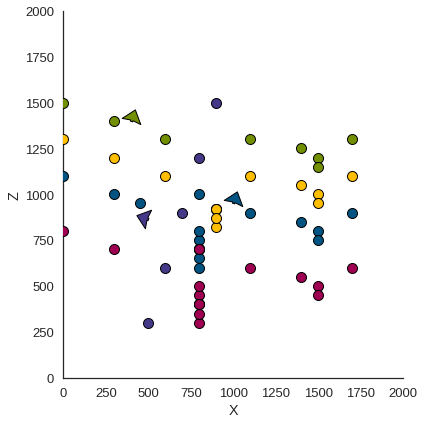
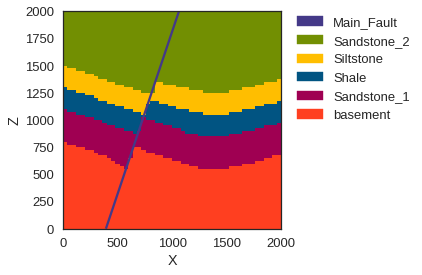

Export a geological model from GemPy to use in MOOSE
====================================================

*implemented by*\ `Jan Niederau <https://github.com/Japhiolite>`__

This is a small example notebook guiding you through the process of
exporting a geological model generated in
`GemPy <https://www.gempy.org/>`__ (Tutorial Chapter 1-1 therein) so it
is usable as a Mesh in the `MOOSE <https://mooseframework.org/>`__
framework.

.. code:: ipython3

    # These two lines are necessary only if GemPy is not installed 
    import sys, os
    sys.path.append("../../../gempy/")
    
    import gempy as gp
    
    import matplotlib.pyplot as plt
    %matplotlib inline

Creating a geological model
---------------------------

The procedure of generating a geological model is presented in detail in
`Chapter
1-1 <https://nbviewer.jupyter.org/github/cgre-aachen/gempy/blob/master/notebooks/tutorials/ch1-1_Basics.ipynb>`__
of the GemPy tutorials, so it will only be briefly presented here

.. code:: ipython3

    # Initiate a model
    geo_model = gp.create_model('tutorial_moose_exp')

.. code:: ipython3

    gempy_dir = '../../../gempy/notebooks'
    # Import data from CSV-files with setting the resolution and model extent
    gp.init_data(geo_model, [0,2000., 0,2000., 0,2000.], [50, 50, 80],
                path_o = gempy_dir+"/data/input_data/tut_chapter1/simple_fault_model_orientations.csv",
                path_i = gempy_dir+"/data/input_data/tut_chapter1/simple_fault_model_points.csv",
                default_values = True);

.. parsed-literal::

    Active grids: ['regular']

.. code:: ipython3

    # present the units and series
    geo_model.surfaces

.. raw:: html

    <table id="T_7be2de78_9681_11ea_b60b_184f329eea2d" ><thead>    <tr>        <th class="blank level0" ></th>        <th class="col_heading level0 col0" >surface</th>        <th class="col_heading level0 col1" >series</th>        <th class="col_heading level0 col2" >order_surfaces</th>        <th class="col_heading level0 col3" >isActive</th>        <th class="col_heading level0 col4" >color</th>        <th class="col_heading level0 col5" >id</th>    </tr></thead><tbody>
                    <tr>
                            <th id="T_7be2de78_9681_11ea_b60b_184f329eea2dlevel0_row0" class="row_heading level0 row0" >0</th>
                            <td id="T_7be2de78_9681_11ea_b60b_184f329eea2drow0_col0" class="data row0 col0" >Shale</td>
                            <td id="T_7be2de78_9681_11ea_b60b_184f329eea2drow0_col1" class="data row0 col1" >Default series</td>
                            <td id="T_7be2de78_9681_11ea_b60b_184f329eea2drow0_col2" class="data row0 col2" >1</td>
                            <td id="T_7be2de78_9681_11ea_b60b_184f329eea2drow0_col3" class="data row0 col3" >True</td>
                            <td id="T_7be2de78_9681_11ea_b60b_184f329eea2drow0_col4" class="data row0 col4" >#015482</td>
                            <td id="T_7be2de78_9681_11ea_b60b_184f329eea2drow0_col5" class="data row0 col5" >1</td>
                </tr>
                <tr>
                            <th id="T_7be2de78_9681_11ea_b60b_184f329eea2dlevel0_row1" class="row_heading level0 row1" >1</th>
                            <td id="T_7be2de78_9681_11ea_b60b_184f329eea2drow1_col0" class="data row1 col0" >Sandstone_1</td>
                            <td id="T_7be2de78_9681_11ea_b60b_184f329eea2drow1_col1" class="data row1 col1" >Default series</td>
                            <td id="T_7be2de78_9681_11ea_b60b_184f329eea2drow1_col2" class="data row1 col2" >2</td>
                            <td id="T_7be2de78_9681_11ea_b60b_184f329eea2drow1_col3" class="data row1 col3" >True</td>
                            <td id="T_7be2de78_9681_11ea_b60b_184f329eea2drow1_col4" class="data row1 col4" >#9f0052</td>
                            <td id="T_7be2de78_9681_11ea_b60b_184f329eea2drow1_col5" class="data row1 col5" >2</td>
                </tr>
                <tr>
                            <th id="T_7be2de78_9681_11ea_b60b_184f329eea2dlevel0_row2" class="row_heading level0 row2" >2</th>
                            <td id="T_7be2de78_9681_11ea_b60b_184f329eea2drow2_col0" class="data row2 col0" >Siltstone</td>
                            <td id="T_7be2de78_9681_11ea_b60b_184f329eea2drow2_col1" class="data row2 col1" >Default series</td>
                            <td id="T_7be2de78_9681_11ea_b60b_184f329eea2drow2_col2" class="data row2 col2" >3</td>
                            <td id="T_7be2de78_9681_11ea_b60b_184f329eea2drow2_col3" class="data row2 col3" >True</td>
                            <td id="T_7be2de78_9681_11ea_b60b_184f329eea2drow2_col4" class="data row2 col4" >#ffbe00</td>
                            <td id="T_7be2de78_9681_11ea_b60b_184f329eea2drow2_col5" class="data row2 col5" >3</td>
                </tr>
                <tr>
                            <th id="T_7be2de78_9681_11ea_b60b_184f329eea2dlevel0_row3" class="row_heading level0 row3" >3</th>
                            <td id="T_7be2de78_9681_11ea_b60b_184f329eea2drow3_col0" class="data row3 col0" >Sandstone_2</td>
                            <td id="T_7be2de78_9681_11ea_b60b_184f329eea2drow3_col1" class="data row3 col1" >Default series</td>
                            <td id="T_7be2de78_9681_11ea_b60b_184f329eea2drow3_col2" class="data row3 col2" >4</td>
                            <td id="T_7be2de78_9681_11ea_b60b_184f329eea2drow3_col3" class="data row3 col3" >True</td>
                            <td id="T_7be2de78_9681_11ea_b60b_184f329eea2drow3_col4" class="data row3 col4" >#728f02</td>
                            <td id="T_7be2de78_9681_11ea_b60b_184f329eea2drow3_col5" class="data row3 col5" >4</td>
                </tr>
                <tr>
                            <th id="T_7be2de78_9681_11ea_b60b_184f329eea2dlevel0_row4" class="row_heading level0 row4" >4</th>
                            <td id="T_7be2de78_9681_11ea_b60b_184f329eea2drow4_col0" class="data row4 col0" >Main_Fault</td>
                            <td id="T_7be2de78_9681_11ea_b60b_184f329eea2drow4_col1" class="data row4 col1" >Default series</td>
                            <td id="T_7be2de78_9681_11ea_b60b_184f329eea2drow4_col2" class="data row4 col2" >5</td>
                            <td id="T_7be2de78_9681_11ea_b60b_184f329eea2drow4_col3" class="data row4 col3" >True</td>
                            <td id="T_7be2de78_9681_11ea_b60b_184f329eea2drow4_col4" class="data row4 col4" >#443988</td>
                            <td id="T_7be2de78_9681_11ea_b60b_184f329eea2drow4_col5" class="data row4 col5" >5</td>
                </tr>
                <tr>
                            <th id="T_7be2de78_9681_11ea_b60b_184f329eea2dlevel0_row5" class="row_heading level0 row5" >5</th>
                            <td id="T_7be2de78_9681_11ea_b60b_184f329eea2drow5_col0" class="data row5 col0" >basement</td>
                            <td id="T_7be2de78_9681_11ea_b60b_184f329eea2drow5_col1" class="data row5 col1" >Basement</td>
                            <td id="T_7be2de78_9681_11ea_b60b_184f329eea2drow5_col2" class="data row5 col2" >1</td>
                            <td id="T_7be2de78_9681_11ea_b60b_184f329eea2drow5_col3" class="data row5 col3" >True</td>
                            <td id="T_7be2de78_9681_11ea_b60b_184f329eea2drow5_col4" class="data row5 col4" >#ff3f20</td>
                            <td id="T_7be2de78_9681_11ea_b60b_184f329eea2drow5_col5" class="data row5 col5" >6</td>
                </tr>
        </tbody></table>

.. code:: ipython3

    # combine units in series and make two series, as the fault needs its own
    gp.map_series_to_surfaces(geo_model,
                             {"Fault_Series" : 'Main_Fault',
                              "Strat_Series" : ('Sandstone_2', 'Siltstone', 'Shale', 'Sandstone_1', 'basement')},
                             remove_unused_series=True);
    
    # set the fault series to be fault object
    geo_model.set_is_fault(['Fault_Series'], change_color=False)

.. raw:: html

    <table border="1" class="dataframe">
      <thead>
        <tr style="text-align: right;">
          <th></th>
          <th>isFault</th>
          <th>isFinite</th>
        </tr>
      </thead>
      <tbody>
        <tr>
          <th>Fault_Series</th>
          <td>True</td>
          <td>False</td>
        </tr>
        <tr>
          <th>Strat_Series</th>
          <td>False</td>
          <td>False</td>
        </tr>
      </tbody>
    </table>

.. code:: ipython3

    # check whether series were assigned correctly
    geo_model.surfaces

.. raw:: html

    <table id="T_7c1e54bc_9681_11ea_b60b_184f329eea2d" ><thead>    <tr>        <th class="blank level0" ></th>        <th class="col_heading level0 col0" >surface</th>        <th class="col_heading level0 col1" >series</th>        <th class="col_heading level0 col2" >order_surfaces</th>        <th class="col_heading level0 col3" >isActive</th>        <th class="col_heading level0 col4" >color</th>        <th class="col_heading level0 col5" >id</th>    </tr></thead><tbody>
                    <tr>
                            <th id="T_7c1e54bc_9681_11ea_b60b_184f329eea2dlevel0_row0" class="row_heading level0 row0" >4</th>
                            <td id="T_7c1e54bc_9681_11ea_b60b_184f329eea2drow0_col0" class="data row0 col0" >Main_Fault</td>
                            <td id="T_7c1e54bc_9681_11ea_b60b_184f329eea2drow0_col1" class="data row0 col1" >Fault_Series</td>
                            <td id="T_7c1e54bc_9681_11ea_b60b_184f329eea2drow0_col2" class="data row0 col2" >1</td>
                            <td id="T_7c1e54bc_9681_11ea_b60b_184f329eea2drow0_col3" class="data row0 col3" >True</td>
                            <td id="T_7c1e54bc_9681_11ea_b60b_184f329eea2drow0_col4" class="data row0 col4" >#443988</td>
                            <td id="T_7c1e54bc_9681_11ea_b60b_184f329eea2drow0_col5" class="data row0 col5" >1</td>
                </tr>
                <tr>
                            <th id="T_7c1e54bc_9681_11ea_b60b_184f329eea2dlevel0_row1" class="row_heading level0 row1" >0</th>
                            <td id="T_7c1e54bc_9681_11ea_b60b_184f329eea2drow1_col0" class="data row1 col0" >Shale</td>
                            <td id="T_7c1e54bc_9681_11ea_b60b_184f329eea2drow1_col1" class="data row1 col1" >Strat_Series</td>
                            <td id="T_7c1e54bc_9681_11ea_b60b_184f329eea2drow1_col2" class="data row1 col2" >1</td>
                            <td id="T_7c1e54bc_9681_11ea_b60b_184f329eea2drow1_col3" class="data row1 col3" >True</td>
                            <td id="T_7c1e54bc_9681_11ea_b60b_184f329eea2drow1_col4" class="data row1 col4" >#015482</td>
                            <td id="T_7c1e54bc_9681_11ea_b60b_184f329eea2drow1_col5" class="data row1 col5" >2</td>
                </tr>
                <tr>
                            <th id="T_7c1e54bc_9681_11ea_b60b_184f329eea2dlevel0_row2" class="row_heading level0 row2" >1</th>
                            <td id="T_7c1e54bc_9681_11ea_b60b_184f329eea2drow2_col0" class="data row2 col0" >Sandstone_1</td>
                            <td id="T_7c1e54bc_9681_11ea_b60b_184f329eea2drow2_col1" class="data row2 col1" >Strat_Series</td>
                            <td id="T_7c1e54bc_9681_11ea_b60b_184f329eea2drow2_col2" class="data row2 col2" >2</td>
                            <td id="T_7c1e54bc_9681_11ea_b60b_184f329eea2drow2_col3" class="data row2 col3" >True</td>
                            <td id="T_7c1e54bc_9681_11ea_b60b_184f329eea2drow2_col4" class="data row2 col4" >#9f0052</td>
                            <td id="T_7c1e54bc_9681_11ea_b60b_184f329eea2drow2_col5" class="data row2 col5" >3</td>
                </tr>
                <tr>
                            <th id="T_7c1e54bc_9681_11ea_b60b_184f329eea2dlevel0_row3" class="row_heading level0 row3" >2</th>
                            <td id="T_7c1e54bc_9681_11ea_b60b_184f329eea2drow3_col0" class="data row3 col0" >Siltstone</td>
                            <td id="T_7c1e54bc_9681_11ea_b60b_184f329eea2drow3_col1" class="data row3 col1" >Strat_Series</td>
                            <td id="T_7c1e54bc_9681_11ea_b60b_184f329eea2drow3_col2" class="data row3 col2" >3</td>
                            <td id="T_7c1e54bc_9681_11ea_b60b_184f329eea2drow3_col3" class="data row3 col3" >True</td>
                            <td id="T_7c1e54bc_9681_11ea_b60b_184f329eea2drow3_col4" class="data row3 col4" >#ffbe00</td>
                            <td id="T_7c1e54bc_9681_11ea_b60b_184f329eea2drow3_col5" class="data row3 col5" >4</td>
                </tr>
                <tr>
                            <th id="T_7c1e54bc_9681_11ea_b60b_184f329eea2dlevel0_row4" class="row_heading level0 row4" >3</th>
                            <td id="T_7c1e54bc_9681_11ea_b60b_184f329eea2drow4_col0" class="data row4 col0" >Sandstone_2</td>
                            <td id="T_7c1e54bc_9681_11ea_b60b_184f329eea2drow4_col1" class="data row4 col1" >Strat_Series</td>
                            <td id="T_7c1e54bc_9681_11ea_b60b_184f329eea2drow4_col2" class="data row4 col2" >4</td>
                            <td id="T_7c1e54bc_9681_11ea_b60b_184f329eea2drow4_col3" class="data row4 col3" >True</td>
                            <td id="T_7c1e54bc_9681_11ea_b60b_184f329eea2drow4_col4" class="data row4 col4" >#728f02</td>
                            <td id="T_7c1e54bc_9681_11ea_b60b_184f329eea2drow4_col5" class="data row4 col5" >5</td>
                </tr>
                <tr>
                            <th id="T_7c1e54bc_9681_11ea_b60b_184f329eea2dlevel0_row5" class="row_heading level0 row5" >5</th>
                            <td id="T_7c1e54bc_9681_11ea_b60b_184f329eea2drow5_col0" class="data row5 col0" >basement</td>
                            <td id="T_7c1e54bc_9681_11ea_b60b_184f329eea2drow5_col1" class="data row5 col1" >Strat_Series</td>
                            <td id="T_7c1e54bc_9681_11ea_b60b_184f329eea2drow5_col2" class="data row5 col2" >5</td>
                            <td id="T_7c1e54bc_9681_11ea_b60b_184f329eea2drow5_col3" class="data row5 col3" >True</td>
                            <td id="T_7c1e54bc_9681_11ea_b60b_184f329eea2drow5_col4" class="data row5 col4" >#ff3f20</td>
                            <td id="T_7c1e54bc_9681_11ea_b60b_184f329eea2drow5_col5" class="data row5 col5" >6</td>
                </tr>
        </tbody></table>

Model generation
----------------

After loading in the data, we set it up for interpolation and compute
the model.

.. code:: ipython3

    # set up interpolator
    gp.set_interpolation_data(geo_model,
                              compile_theano=True, 
                              theano_optimizer='fast_compile',
                              verbose=[])

.. parsed-literal::

    Setting kriging parameters to their default values.
    Compiling theano function...
    Level of Optimization:  fast_compile
    Device:  cpu
    Precision:  float64
    Number of faults:  1
    Compilation Done!
    Kriging values: 
                      values
    range            3464.1
    $C_o$            285714
    drift equations  [3, 3]

.. parsed-literal::

    <gempy.core.interpolator.InterpolatorModel at 0x7f3a95e9cc88>

.. code:: ipython3

    # compute the model
    gp.compute_model(geo_model, compute_mesh=False);

.. code:: ipython3

    # have a look at the data and computed model
    gp.plot.plot_data(geo_model, direction='y')

.. parsed-literal::

    <gempy.plot.visualization_2d.PlotData2D at 0x7f3aea1af278>

.. code:: ipython3

    gp.plot.plot_section(geo_model, cell_number=24, direction='y',
                         show_data=False, show_legend=True)

.. parsed-literal::

    <gempy.plot.visualization_2d.PlotSolution at 0x7f3a92adb7b8>

Exporting the Model to MOOSE
----------------------------

The voxel-model above already is the same as a model discretized in a
hexahedral grid, so my immediately be used as input in a simulation
tool, e.g. `MOOSE <https://mooseframework.org/>`__. For this, we need to
access to the unit IDs assigned to each voxel in GemPy. The array
containing these IDs is called ``lith_block``.

.. code:: ipython3

    ids = geo_model.solutions.lith_block
    print(ids)

.. parsed-literal::

    [6. 6. 6. ... 2. 2. 2.]

This array has the shape of ``(x,)`` and would be immediately useful, if
GemPy and the chosen simulation code would *populate* a grid in the same
way. Of course, however, that is not the case. This is why we have to
restructure the ``lith_block`` array, so it can be read correctly by
MOOSE.

.. code:: ipython3

    # model resolution
    nx, ny, nz = geo_model.grid.regular_grid.resolution
    
    # model extent
    xmin, xmax, ymin, ymax, zmin, zmax = geo_model.grid.regular_grid.extent

These two parameters are important to, a) restructure ``lith_block``,
and b) write the input file for MOOSE correctly. For a), we need to
reshape ``lith_block`` again to its three dimensions and *re-flatten* it
in a *MOOSE-conform* way.

.. code:: ipython3

    # reshape to 3D array
    units = ids.reshape((nx, ny, nz))
    # flatten MOOSE conform
    units = units.flatten('F')

| The importance of ``nx, ny, nz`` is apparent from the cell above. But
  what about ``xmin``, …, ``zmax``?
| A MOOSE input-file for mesh generation has the following syntax:

.. code:: python

   [MeshGenerators]
     [./gmg]
       type = GeneratedMeshGenerator
       dim = 3
       nx = 50
       ny = 50
       nz = 80
       xmin = 0.0
       xmax = 2000.0
       yim = 0.0
       ymax = 2000.0
       zmin = 0.0
       zmax = 2000.0
       block_id = '1 2 3 4 5 6'
       block_name = 'Main_Fault Sandstone_2 Siltstone Shale Sandstone_1 basement'
     [../]

     [./subdomains]
       type = ElementSubdomainIDGenerator
       input = gmg
       subdomain_ids = ' ' # here you paste the transformed lith_block vector
     [../]
   []

   [Mesh]
     type = MeshGeneratorMesh
   []

So these parameters are required inputs in the ``[MeshGenerators]``
object in the MOOSE input file. ``GemPy`` has a method to directly
create such an input file, stored in ``gempy.utils.export.py``.

The following cell shows how to call the method:

.. code:: ipython3

    import gempy.utils.export as export
    export.export_moose_input(geo_model, path='')

.. parsed-literal::

    Successfully exported geological model as moose input to ./

This method automatically stores a file
``geo_model_units_moose_input.i`` at the specified path. Either this
input file could be extended with parameters to directly run a
simulation, or it is used just for creating a mesh. In the latter case,
the next step would be, to run the compiled MOOSE executable witch the
optional flag ``--mesh-only``.

E.g. with using the `PorousFlow
module <https://mooseframework.inl.gov/modules/porous_flow/>`__:

.. code:: bash

   $path_to_moose/moose/modules/porous_flow/porous_flow-opt -i pct_voxel_mesh.i --mesh-only

How to compile MOOSE is described in their
`documentation <https://mooseframework.inl.gov/getting_started/index.html>`__.

The now generated mesh with the name
``geo_model_units_moose_input_in.e`` can be used as input for another
MOOSE input file, which contains the main simulation parameters. To call
the file with the grid, the following part has to be added in the MOOSE
simulation input file:

.. code:: python

   [Mesh]
     file = geo_model_units_moose_input_in.e
   []

.. raw:: html

   

The final output of the simulation may also be such an ``.e``, which
can, for instance, be opened with
`paraview <https://www.paraview.org/>`__. A simulated temperature field
(purely conductive) of the created model would look like this:

.. figure:: https://raw.githubusercontent.com/Japhiolite/a-Moose-and-you/master/imgs/GemPy_model_combined.png
   :alt: gempy_temperature

   gempy_temperature
